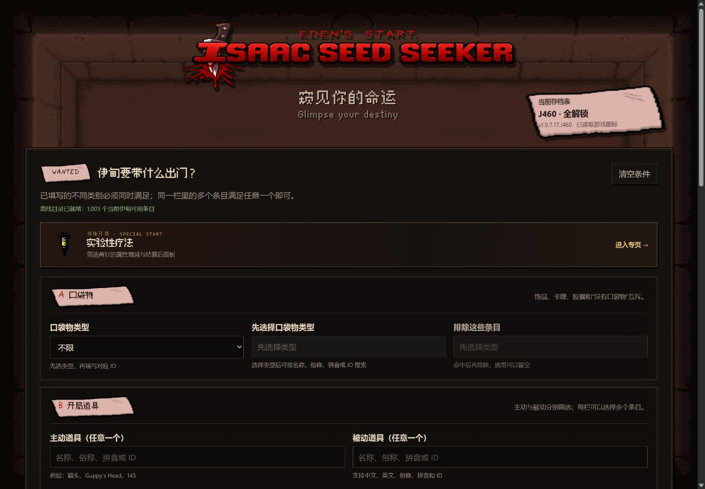

# Isaac Seed Seeker

> [!NOTE]
> 本项目在设计、实现、测试与文档整理过程中大量使用 OpenAI Codex 辅助完成。

面向《以撒的结合：忏悔+》伊甸开局的离线种子筛选器。

Isaac Seed Seeker 使用原生 C++ 内核枚举种子，并通过本地 WebUI 提供条件配置、结果排序和导出功能。项目当前主要覆盖伊甸的初始道具、口袋物、资源、生命值及基础随机属性。



## 主要功能

- 按 ID 或名称筛选主动道具、被动道具、饰品、卡牌和胶囊；
- 名称目录支持中文、英文、常用别名和拼音检索；
- 筛选红心、魂心、钱、钥匙、炸弹及六项基础属性；
- 支持包含条件、排除条件、数值区间和多类别组合；
- 提供实验性疗法（黄针）专用搜索，可筛选结算后的精确属性范围；
- 提供“每日一爽”和“每日毒种”，可随机更换当天推荐，也可按需揭晓开局；
- 按属性、资源或道具品质排序结果；
- 支持多线程全域扫描、进度显示、停止任务和 TXT 导出；
- 单个原生程序运行，计算与页面服务均在本机完成。

## 兼容范围

当前内置 Profile 基于以下环境：

- 游戏版本：`v1.9.7.17.J460`；
- 存档状态：全解锁；
- 平台：Windows x64；
- Mod 环境：未启用会改变角色、道具池或开局生成逻辑的内容型 Mod。

界面及便利性 Mod 通常不会影响本项目模拟的伊甸生成流程。普通与困难模式在当前搜索范围内使用相同的开局生成模型。

## 安装

当前公开测试版本为 [v0.2.0](https://github.com/scy114/isaac-seed-seeker/releases/tag/v0.2.0)。

1. 从 [GitHub Releases](https://github.com/scy114/isaac-seed-seeker/releases) 下载 `IsaacSeedSeeker-v0.2.0-windows-x64.zip`；
2. 完整解压 ZIP；
3. 运行 `IsaacSeedSeeker.exe`；
4. 程序将在默认浏览器中打开本地 WebUI；
5. 使用完毕后，通过页面底部的“关闭本地程序”结束进程。

发行包无需另行安装 Python、Node.js 或编译工具链。请勿直接在压缩包预览窗口中运行程序。

详细操作说明见 [中文快速上手](docs/quick-start.zh-CN.txt)。

## 使用方法

### 配置筛选条件

各筛选类别之间使用逻辑 AND，同一类别内的多个候选使用逻辑 OR。例如：

```text
饰品：169
主动道具：145 或 133
被动道具：81、134、187、212 或 665
```

以上配置要求三类条件同时成立。排除列表中的任意条目一旦命中，该种子将被过滤。

数值条件支持仅设置下限、仅设置上限或同时设置闭区间。未填写的条件不参与筛选。

### 执行扫描

默认扫描范围覆盖全部 `2^32 - 1` 个可搜索种子值。线程数通常保持默认设置即可。

“内存载入上限”只限制 WebUI 保留的结果数量，不会提前终止种子扫描。命中数量超过上限时，程序仍会返回完整命中总数，并保留当前排序下的全局 Top-K 结果。

### 查看与导出结果

结果表支持按血量、资源、属性、主动道具品质、被动道具品质及总品质升降序排列。当前结果可以导出为 TXT 文件。

### 每日一爽

“每日一爽”按北京时间日期生成一个公共伊甸开局种子。同一规则版本下，所有玩家首次领取的种子相同；点击“换一个”会从当天合格候选中重新抽取，并避免立即重复。默认只展示游戏种子，点击“开辉眼”后可查看开局道具、资源和属性。

### 每日毒种

“每日毒种”使用独立的每日种子序列。当前粗筛要求移速低于 `1.0`、射速低于 `3.0`、伤害低于 `3.0`，并且主动与被动道具的总品质不超过 `1`。所有满足条件的开局等概率参与抽取；页面同样支持换种和按需揭晓。

## 数据语义

- 普通搜索中的属性是伊甸生成完成、开局道具生效前的基础面板值；
- 血量同样不包含开局道具额外提供的心；
- 钱、钥匙和炸弹仅表示伊甸自身生成的初始资源，不包含道具生成的掉落物；
- 普通饰品与金色饰品按相同的基础饰品 ID 匹配；
- 胶囊依据每局种子生成的“颜色到效果”映射筛选，结果同时显示效果与颜色；
- PHD、假 PHD、幸运脚等道具可能改变胶囊实际服用时的效果，但不会改变搜索使用的原始效果 ID。

## 实验性疗法搜索

实验性疗法使用独立页面和专用结算模型。搜索条件包括：

- 指定某项属性上升、下降或不变；
- 限制黄针生效前的基础属性；
- 限制黄针结算后的最终属性范围。

目前支持精确计算伤害、移速、射速、射程、弹速和幸运。生命值暂时只支持方向判断。页面会在扫描前检查方向配额及数值范围之间的冲突。

## 项目来源

本项目建立在现有社区研究成果之上：

- [2o181o28/eden-seed-finder](https://github.com/2o181o28/eden-seed-finder)：伊甸全域搜索、游戏内验证方法及实验性疗法 RNG 研究；
- [KamiMisuzu/isaac-repentance-eden-seed-decoder](https://github.com/KamiMisuzu/isaac-repentance-eden-seed-decoder)：J460 伊甸生成、运行时表和道具池研究；
- [falsidge/isaac_rng](https://github.com/falsidge/isaac_rng)：忏悔+胶囊池初始化与颜色映射研究；
- [Eden Generation Wiki](https://bindingofisaacrebirth.wiki.gg/wiki/Eden_Generation)：伊甸生成规则及社区整理资料。

本仓库在上述研究的基础上实现了独立的 C++ 搜索内核，并扩展了饰品与口袋物搜索、名称目录、资源和属性筛选、组合条件、排序、导出、实验性疗法精确搜索及本地 WebUI。

仓库未直接收录上述项目的源码文件。参考版本、实现边界和验证记录见 [研究文档](docs/research.md)。

## 从源码构建

开发环境需要 Windows、CMake，以及支持 C++20 的 MinGW-w64 工具链。

构建并运行测试：

```powershell
.\scripts\build-native.ps1 -RunTests
```

启动本地 WebUI：

```powershell
.\build\native\IsaacSeedSeeker.exe
```

生成 Windows 发行包并执行打包自检：

```powershell
.\scripts\package-windows.ps1
```

## 问题反馈

请通过 [GitHub Issues](https://github.com/scy114/isaac-seed-seeker/issues) 提交问题，并尽量提供以下信息：

- Isaac Seed Seeker 版本；
- 游戏版本与存档解锁状态；
- 完整筛选条件和种子；
- 已启用的内容型 Mod；
- 游戏内观察结果。

## 许可证

本项目的原创代码使用 [MIT License](LICENSE)。第三方字体与数据目录分别遵循各自附带的许可证；《以撒的结合》相关名称及游戏美术资源的权利归其权利人所有。
